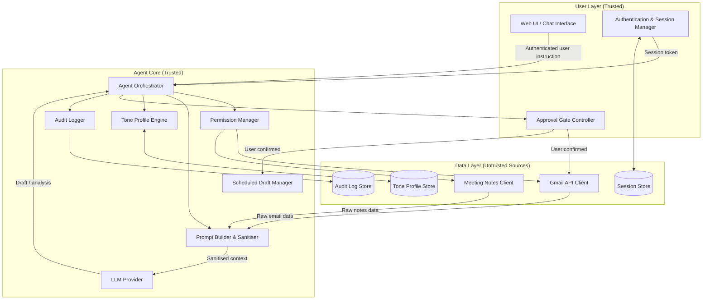
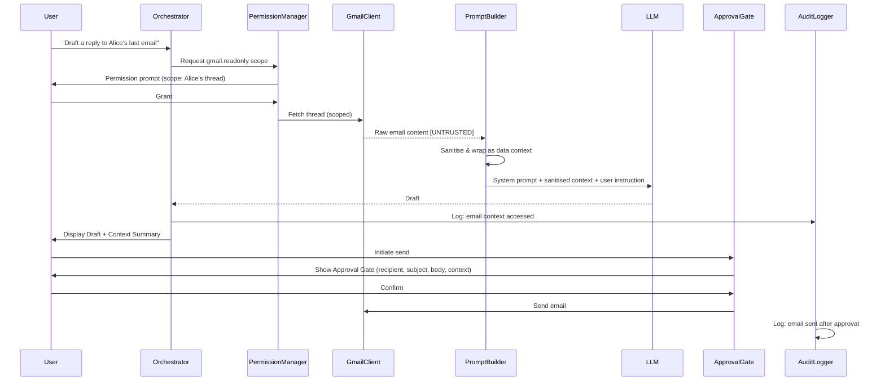

# Design Document: Secure AI Executive Assistant

## Overview

The Secure AI Executive Assistant is a safety-first AI agent that helps business professionals manage email workflows. It integrates with Gmail via OAuth 2.0 to draft emails, retrieve context, adapt writing tone per recipient, extract meeting note insights, and prepare scheduled sends — all under strict human-in-the-loop controls.

The central design principle is **trust hierarchy**: the system distinguishes sharply between trusted user instructions (received through the authenticated session channel) and untrusted external content (email bodies, meeting notes, documents). No content from external sources is ever interpreted as an instruction. Every sensitive action requires an explicit user approval gate before execution.

### Key Design Decisions

- **Gmail-only integration**: Simplifies the OAuth scope surface and reduces attack vectors. No other email platform is in scope.
- **Incremental OAuth authorisation**: Scopes are requested at the point of need, not all at once at login. This follows Google's recommended best practice and gives users fine-grained control.
- **Tone Profiles as persistent, incrementally-updated records**: Profiles are stored in a local database, built from sent history analysis, and updated after each confirmed send — avoiding expensive re-analysis on every session.
- **Active confirmation for scheduled sends**: When a scheduled send time arrives, the user must click a confirm button. There is no passive cancel window. This prevents emails from being sent without the user's active attention.
- **LLM Provider — Google Gemini 1.5 Flash (free tier)**: Accessed via the `google-generativeai` Python SDK using a Gemini API key from Google AI Studio. The free tier supports up to 15 requests/min and 1 million tokens/day, sufficient for development and moderate production use. No billing account required.

- **Dual-layer prompt injection defence**: Untrusted content is sanitised before being placed in the LLM context, and the system prompt enforces strict role separation so the LLM treats retrieved content as data, not instructions.

The system follows a layered architecture with a clear trust boundary between the user-facing layer and the external data layer.



### Trust Boundary

The trust boundary sits between the Agent Core and the Data Layer. All data crossing this boundary is treated as untrusted and passes through the Prompt Builder & Sanitiser before reaching the LLM. The LLM never receives raw, unsanitised external content.



---

## Components and Interfaces

### 1. Authentication & Session Manager

Responsible for user identity verification and session lifecycle.

**Responsibilities:**
- Enforce authentication before any session begins
- Manage session tokens with configurable inactivity timeout
- Rate-limit failed authentication attempts
- Initiate and manage the Gmail OAuth 2.0 flow
- Store only the OAuth token (never Gmail credentials)
- Detect expired/revoked OAuth tokens and suspend Gmail access

**Interface:**
```
authenticate(credentials) → SessionToken | AuthError
validateSession(token) → SessionContext | SessionExpiredError
initiateGmailOAuth() → OAuthRedirectURL
handleOAuthCallback(code, state) → OAuthToken | OAuthError
revokeGmailToken(token) → void
refreshGmailToken(token) → OAuthToken | OAuthError
```

### 2. Permission Manager

Enforces the permission model. No data source is accessed without explicit user grant.

**Responsibilities:**
- Track granted permissions per session
- Present permission prompts to the user before any data access
- Enforce minimum-scope access for each request
- Handle permission revocation and cache invalidation
- Request incremental OAuth scopes at point of need

**Interface:**
```
requestPermission(scope: PermissionScope, justification: string) → PermissionGrant | PermissionDenied
checkPermission(scope: PermissionScope) → boolean
revokePermission(scope: PermissionScope) → void
listActivePermissions() → PermissionGrant[]
```

**Gmail OAuth Scopes (incremental, requested at point of need):**
- `gmail.readonly` — reading email threads and sent history for context and tone analysis
- `gmail.send` — sending approved emails
- `gmail.compose` — creating and managing drafts in Gmail
- `gmail.modify` — deleting emails (only requested if deletion feature is used)

### 3. Agent Orchestrator

The central coordinator. Receives user instructions, coordinates all subsystems, and enforces the human-in-the-loop workflow.

**Responsibilities:**
- Parse and validate user instructions (from authenticated session only)
- Coordinate permission checks before any data access
- Route requests to appropriate subsystems
- Enforce approval gates before sensitive actions
- Maintain conversation context within a session

**Interface:**
```
processInstruction(sessionCtx: SessionContext, instruction: UserInstruction) → AgentResponse
```

### 4. Prompt Builder & Sanitiser

The critical security component that enforces the trust boundary between external content and the LLM.

**Responsibilities:**
- Construct LLM prompts with strict role separation
- Sanitise all untrusted content before inclusion in prompts
- Detect instruction-like patterns in untrusted content
- Wrap untrusted content in explicit data-context delimiters
- Never allow untrusted content to appear in the system prompt or instruction role

**Sanitisation Strategy:**
1. **Pattern detection**: Scan for instruction-like patterns (imperative verbs targeting the agent, role-override phrases, permission escalation language, delimiter injection attempts)
2. **Contextual wrapping**: Wrap all external content in explicit XML-style delimiters that the system prompt instructs the LLM to treat as data only: `<untrusted_content source="gmail">...</untrusted_content>`
3. **Injection flagging**: If high-confidence injection patterns are detected, flag the content, log the event, and notify the user before proceeding
4. **Content truncation**: Enforce maximum token limits on untrusted content to prevent context overflow attacks

**Interface:**
```
buildDraftPrompt(instruction: UserInstruction, context: SanitisedContext, toneProfile: ToneProfile) → LLMPrompt
sanitiseContent(raw: string, source: ContentSource) → SanitisedContent | InjectionAlert
detectInjectionPatterns(content: string) → InjectionScanResult
```

### 5. Tone Profile Engine

Manages the derivation, persistence, and incremental update of Tone Profiles.

**Responsibilities:**
- Derive a Tone Profile by analysing sent history for a recipient
- Retrieve persisted Tone Profiles from the store
- Present the identified tone to the user before draft generation
- Apply user tone overrides
- Incrementally update profiles after confirmed sends
- Apply neutral professional tone when no history exists

**Tone Profile Structure:**
A Tone Profile captures: formality level, greeting style, sign-off style, sentence length tendency, use of technical language, and relationship warmth indicators — derived from statistical analysis of sent emails to that recipient.

**Interface:**
```
getOrDeriveProfile(recipientEmail: string, gmailHistory: EmailMessage[]) → ToneProfile
updateProfile(recipientEmail: string, sentEmail: EmailMessage) → ToneProfile
applyOverride(profile: ToneProfile, override: ToneOverride) → ToneProfile
listProfiles() → ToneProfileSummary[]
```

### 6. Approval Gate Controller

Enforces the human-in-the-loop requirement for all sensitive actions.

**Responsibilities:**
- Present approval gates with full action details before execution
- Block execution until explicit user confirmation
- Handle cancellation (return to draft view without side effects)
- Present active confirmation prompts for scheduled sends at send time
- Enforce configurable timeout for scheduled send confirmations

**Interface:**
```
presentSendGate(draft: Draft, contextSummary: ContextSummary) → ApprovalDecision
presentDeleteGate(email: EmailIdentifier) → ApprovalDecision
presentScheduleGate(draft: Draft, scheduledTime: DateTime) → ApprovalDecision
presentScheduledSendConfirmation(scheduledDraft: ScheduledDraft, timeout: Duration) → ApprovalDecision | TimeoutResult
```

### 7. Scheduled Draft Manager

Manages the lifecycle of scheduled drafts.

**Responsibilities:**
- Register scheduled drafts after approval gate confirmation
- Allow cancellation and editing before send time
- Trigger active confirmation prompts at send time (never auto-send)
- Hold emails if confirmation is not received within timeout
- Notify user when confirmation is required

**Interface:**
```
registerScheduledDraft(draft: Draft, sendTime: DateTime) → ScheduledDraft
cancelScheduledDraft(id: ScheduledDraftId) → void
editScheduledDraft(id: ScheduledDraftId, updates: DraftUpdate) → ScheduledDraft
listScheduledDrafts() → ScheduledDraft[]
triggerSendTimeConfirmation(id: ScheduledDraftId) → void
```

### 8. Audit Logger

Maintains a tamper-evident record of all agent actions.

**Responsibilities:**
- Record all specified event types with timestamp and description
- Prevent modification or deletion of log entries by the agent or untrusted content
- Provide filtered, reverse-chronological log views to the user
- Exclude unnecessary sensitive content (no full email bodies in logs)

**Logged Event Types:**
`DRAFT_CREATED`, `EMAIL_CONTEXT_ACCESSED`, `MEETING_NOTES_ACCESSED`, `PERMISSION_GRANTED`, `PERMISSION_REVOKED`, `APPROVAL_GATE_PRESENTED`, `EMAIL_SENT`, `EMAIL_DELETED`, `SCHEDULED_DRAFT_REGISTERED`, `SCHEDULED_DRAFT_CANCELLED`, `PROMPT_INJECTION_DETECTED`, `AUTH_FAILED`, `SESSION_STARTED`, `SESSION_EXPIRED`, `GMAIL_TOKEN_REVOKED`

**Interface:**
```
log(event: AuditEvent) → void
query(filter: AuditFilter) → AuditEntry[]
```

### 9. Gmail API Client

Wraps the Gmail REST API. All calls are scoped to the minimum necessary permission.

**Responsibilities:**
- Authenticate all requests with the user's OAuth token
- Enforce scope restrictions on each operation
- Retrieve email threads, messages, and sent history
- Send emails, create drafts, delete messages
- Handle token expiry and trigger re-authorisation

**Interface:**
```
listMessages(query: GmailQuery, scope: GmailScope) → EmailMessage[]
getThread(threadId: string) → EmailThread
getSentHistory(recipientEmail: string, limit: number) → EmailMessage[]
sendMessage(message: EmailMessage) → SendResult
createDraft(message: EmailMessage) → GmailDraft
deleteMessage(messageId: string) → void
```

---

## Data Models

```typescript
// Session and Authentication
interface SessionContext {
  sessionId: string;
  userId: string;
  createdAt: Date;
  lastActiveAt: Date;
  expiresAt: Date;
  gmailOAuthToken: OAuthToken | null;
  activePermissions: PermissionGrant[];
}

interface OAuthToken {
  accessToken: string;       // never logged or exposed in responses
  refreshToken: string;      // never logged or exposed in responses
  expiresAt: Date;
  scopes: GmailScope[];
}

// Permissions
type GmailScope =
  | 'gmail.readonly'
  | 'gmail.send'
  | 'gmail.compose'
  | 'gmail.modify';

interface PermissionScope {
  dataSource: 'gmail' | 'meeting_notes' | 'calendar' | 'documents';
  gmailScope?: GmailScope;
  justification: string;
  requestedAt: Date;
}

interface PermissionGrant {
  scope: PermissionScope;
  grantedAt: Date;
  expiresAt: Date | null;   // null = session-scoped
}

// Email and Drafts
interface EmailMessage {
  messageId: string;
  threadId: string;
  from: string;
  to: string[];
  cc: string[];
  subject: string;
  body: string;
  sentAt: Date;
  labels: string[];
}

interface Draft {
  draftId: string;
  recipient: string;
  cc: string[];
  subject: string;
  body: string;
  attachments: Attachment[];
  contextSummary: ContextSummary;
  createdAt: Date;
  toneProfileUsed: ToneProfileSummary | null;
  generatedFromInstruction: string;
}

interface ScheduledDraft {
  scheduledDraftId: string;
  draft: Draft;
  scheduledSendTime: Date;
  registeredAt: Date;
  status: 'pending' | 'awaiting_confirmation' | 'sent' | 'cancelled' | 'held';
  confirmationTimeoutSeconds: number;
}

// Tone Profiles
interface ToneProfile {
  profileId: string;
  recipientEmail: string;
  formalityLevel: 'very_formal' | 'formal' | 'neutral' | 'informal' | 'casual';
  greetingStyle: string;       // e.g. "Hi [Name]," / "Dear [Name],"
  signOffStyle: string;        // e.g. "Best regards," / "Thanks,"
  avgSentenceLength: 'short' | 'medium' | 'long';
  technicalLanguageUsage: 'high' | 'medium' | 'low';
  warmthIndicator: number;     // 0.0 (cold/professional) to 1.0 (warm/personal)
  derivedFromCount: number;    // number of emails used to derive this profile
  lastUpdatedAt: Date;
  createdAt: Date;
}

interface ToneProfileSummary {
  recipientEmail: string;
  formalityLevel: string;
  description: string;         // human-readable summary shown to user
  lastUpdatedAt: Date;
}

// Context and Summaries
interface ContextSummary {
  summaryId: string;
  dataSources: DataSourceReference[];
  generatedFromInstructionOnly: boolean;
}

interface DataSourceReference {
  source: 'gmail' | 'meeting_notes' | 'user_instruction';
  description: string;         // e.g. "Email thread with Alice (3 messages)"
  itemCount: number;
  excerpts: ContentExcerpt[];  // shown when user expands context summary
}

interface ContentExcerpt {
  sourceId: string;
  excerpt: string;             // truncated, no full bodies in summaries
  retrievedAt: Date;
}

// Audit Log
interface AuditEntry {
  entryId: string;
  eventType: AuditEventType;
  timestamp: Date;
  sessionId: string;
  description: string;
  metadata: Record<string, string>;  // no sensitive content (no full email bodies)
}

type AuditEventType =
  | 'DRAFT_CREATED'
  | 'EMAIL_CONTEXT_ACCESSED'
  | 'MEETING_NOTES_ACCESSED'
  | 'PERMISSION_GRANTED'
  | 'PERMISSION_REVOKED'
  | 'APPROVAL_GATE_PRESENTED'
  | 'EMAIL_SENT'
  | 'EMAIL_DELETED'
  | 'SCHEDULED_DRAFT_REGISTERED'
  | 'SCHEDULED_DRAFT_CANCELLED'
  | 'PROMPT_INJECTION_DETECTED'
  | 'AUTH_FAILED'
  | 'SESSION_STARTED'
  | 'SESSION_EXPIRED'
  | 'GMAIL_TOKEN_REVOKED';

// Injection Detection
interface InjectionScanResult {
  detected: boolean;
  confidence: 'low' | 'medium' | 'high';
  patterns: string[];          // descriptions of detected patterns
  source: ContentSource;
}

interface InjectionAlert {
  scanResult: InjectionScanResult;
  originalContent: string;
  sanitisedContent: string;
}

type ContentSource = 'gmail_body' | 'meeting_notes' | 'calendar_entry' | 'document';

// Approval Gates
type ApprovalDecision = 'confirmed' | 'cancelled';

interface TimeoutResult {
  outcome: 'timed_out';
  heldDraftId: string;
}
```

---

## Correctness Properties

*A property is a characteristic or behavior that should hold true across all valid executions of a system — essentially, a formal statement about what the system should do. Properties serve as the bridge between human-readable specifications and machine-verifiable correctness guarantees.*

### Property 1: Untrusted content never reaches the LLM as instructions

*For any* piece of external content (email body, meeting notes, calendar entry, document), after sanitisation and contextual wrapping, the resulting LLM prompt must place that content exclusively in the data context role — never in the system prompt or user instruction role. The system prompt and user instruction sections must contain only content originating from the authenticated user session and system rules.

**Validates: Requirements 8.1, 9.1, 9.2**

---

### Property 2: Injection pattern detection is consistent

*For any* string that contains a known injection pattern (imperative agent commands, role-override phrases, permission escalation language, delimiter injection attempts), the sanitiser must detect it as a potential injection attempt. Conversely, for any string that contains no such patterns, the sanitiser must not produce a false positive.

**Validates: Requirements 8.2, 8.3**

---

### Property 3: Approval gate always precedes sensitive action execution

*For any* sensitive action (send email, delete email, register scheduled draft), the system must present an approval gate and receive an explicit `confirmed` decision before executing the action. No sensitive action may be executed following a `cancelled` decision, and no sensitive action may be executed without an approval gate having been presented in the same request flow.

**Validates: Requirements 5.2, 5.5, 6.2, 6.4, 7.2**

---

### Property 4: Confirmed action produces both execution and audit entry

*For any* sensitive action where the user confirms the approval gate, the system must both execute the action (send the email, delete the email, or register the scheduled draft) and create a corresponding audit log entry. Neither may occur without the other.

**Validates: Requirements 5.3, 6.3, 7.3**

---

### Property 5: Scheduled sends require active confirmation at send time

*For any* registered scheduled draft, when the scheduled send time arrives, the system must present an active confirmation prompt and receive an explicit user click before transmitting the email. If no confirmation is received within the configurable timeout period, the email must be held with status `held` and the user must be notified — the email must not be sent.

**Validates: Requirements 7.5, 7.6**

---

### Property 6: Permission check precedes every data access

*For any* data retrieval operation (Gmail messages, meeting notes, calendar data, documents), the system must verify that a valid, unexpired permission grant exists for the required scope before accessing the data. If no grant exists, the system must request permission from the user before proceeding. No data access may occur without a prior grant.

**Validates: Requirements 3.1, 3.2, 4.1, 4.2, 10.1, 10.6**

---

### Property 7: Tone Profile round-trip persistence

*For any* Tone Profile derived from sent history, serialising it to the persistent store and then retrieving it in a new session must produce an equivalent profile with all fields preserved and no data loss.

**Validates: Requirements 2.7**

---

### Property 8: Tone Profile incremental update preserves prior data

*For any* existing Tone Profile and any newly sent email to the same recipient, applying an incremental update must produce a profile where `derivedFromCount` is exactly one greater than before, and all previously stored profile fields remain present (none are deleted or reset).

**Validates: Requirements 2.6, 2.7**

---

### Property 9: Audit log entries are append-only

*For any* sequence of audit log writes, the log must contain all written entries in the order they were written. No entry may be absent, modified, or reordered — whether by any agent operation, by processing untrusted content, or by any other system process.

**Validates: Requirements 12.4**

---

### Property 10: Audit log entries contain required fields and no full email bodies

*For any* audit log entry, the entry must contain the event type, a timestamp, and a description. Additionally, for any audit log entry created in response to an event involving email data, the entry's metadata must not contain the full body of any email message.

**Validates: Requirements 12.1, 12.2**

---

### Property 11: Context Summary completeness

*For any* draft generated using retrieved data from one or more external sources, the Context Summary must reference every data source that was accessed during generation. No accessed source may be omitted from the summary, regardless of how many sources were used.

**Validates: Requirements 1.5, 3.5, 4.4, 13.1**

---

### Property 12: Context Summary displayed before approval gate

*For any* draft that has a Context Summary (i.e., was generated using external data), the system must display the Context Summary to the user before presenting the approval gate. The approval gate must not be presented until the context summary has been shown.

**Validates: Requirements 13.2**

---

### Property 13: Session expiry blocks all sensitive actions

*For any* sensitive action attempted after a session has expired or been terminated, the system must reject the action and require re-authentication. No sensitive action may succeed on an expired or unauthenticated session, regardless of the action type.

**Validates: Requirements 14.2, 14.3**

---

### Property 14: Permission revocation immediately stops data access

*For any* permission that has been revoked, all subsequent data access attempts for that scope must be denied and any cached data from that scope must be cleared. No data from a revoked permission scope may be returned or used in any subsequent operation within the same session.

**Validates: Requirements 10.4, 10.5**

---

### Property 15: Untrusted content cannot alter system state or permissions

*For any* untrusted content that contains permission-escalation instructions, role-override directives, or system-rule modification attempts, processing that content must leave the system's permission state, active session context, and operational rules entirely unchanged. The system must discard the embedded instruction, log the event, and notify the user.

**Validates: Requirements 9.3, 9.4**

---

### Property 16: Audit log displayed in reverse chronological order

*For any* set of audit log entries with distinct timestamps, when displayed to the user, the entries must appear in strictly reverse chronological order (most recent first). This ordering must hold regardless of the order in which entries were written to the log.

**Validates: Requirements 12.5**

---

### Property 17: Failed authentication triggers rate limiting

*For any* sequence of failed authentication attempts from the same origin that exceeds the configured threshold, all subsequent authentication attempts from that origin must be rate-limited (delayed or rejected) until the rate-limit window expires.

**Validates: Requirements 14.4**

---

### Property 18: Draft structure completeness

*For any* valid user instruction to draft an email, the generated Draft must contain a non-empty recipient, a non-empty subject line, and a non-empty body. No draft with any of these fields absent or empty may be presented to the user as a completed draft.

**Validates: Requirements 1.1**

---

## Error Handling

### Authentication Errors
- **Failed authentication**: Log the attempt, apply exponential back-off rate limiting per origin, return a generic error message (no information leakage about why authentication failed)
- **Expired session**: Terminate session, clear session state, prompt re-authentication before any further action
- **Expired/revoked OAuth token**: Suspend all Gmail operations, notify user, prompt re-authorisation via OAuth flow

### Gmail API Errors
- **No messages found**: Notify user that no relevant emails were found for the requested scope; proceed without email context
- **API rate limit**: Implement exponential back-off with jitter; surface a user-friendly message if retries are exhausted
- **Insufficient scope**: Request the required incremental scope from the user before retrying
- **Network failure**: Surface a descriptive error; do not silently fail or proceed with partial data

### Prompt Injection Handling
- **Low-confidence detection**: Sanitise the content, wrap it in data delimiters, proceed with a subtle user notification
- **High-confidence detection**: Flag the content prominently to the user, log the event in the audit log with source details, ask the user whether to proceed with the sanitised content or discard it
- **Permission escalation attempt in content**: Discard the instruction, log the event, notify the user

### Draft Generation Errors
- **Insufficient instructions**: Prompt the user for the missing information; do not generate an incomplete draft
- **LLM generation failure**: Surface a descriptive error; do not return a partial or malformed draft
- **Tone Profile unavailable**: Notify the user, apply neutral professional tone, offer tone override options

### Scheduled Draft Errors
- **Confirmation timeout at send time**: Hold the email, update status to `held`, notify the user that confirmation is required
- **User unavailable at send time**: Same as timeout — hold, do not send
- **Cancellation after send time passed**: If the email was held (not sent), allow cancellation; if already sent, inform the user

### Data Privacy Errors
- **Attempt to access data beyond request scope**: Deny access, log the attempt, notify the user
- **Attempt to transmit user data to third party without consent**: Block the operation, log the event, notify the user

---

## Testing Strategy

### Dual Testing Approach

The testing strategy combines unit tests for specific examples and edge cases with property-based tests for universal correctness guarantees. Both are necessary: unit tests catch concrete bugs in specific scenarios, while property tests verify that invariants hold across the full input space.

### Property-Based Testing

Property-based testing is applicable to this feature because the core logic — prompt sanitisation, permission enforcement, approval gate sequencing, tone profile management, and audit logging — consists of functions with clear input/output behaviour and universal properties that should hold across all valid inputs.

**Library**: [Hypothesis](https://hypothesis.readthedocs.io/) (Python)

**Configuration**: Minimum 100 iterations per property test.

**Tag format**: `# Feature: secure-ai-executive-assistant, Property {N}: {property_text}`

Each correctness property from the design document maps to exactly one property-based test:

| Property | Test Focus | Generator Strategy |
|---|---|---|
| P1: Untrusted content never as instructions | Prompt structure validation | Generate arbitrary strings as "external content"; verify prompt role placement |
| P2: Injection pattern detection consistency | Sanitiser accuracy | Generate strings with/without injection patterns; verify detection results |
| P3: Approval gate before sensitive actions | Action sequencing | Generate arbitrary sensitive action requests; verify gate is always presented first |
| P4: Confirmed action produces execution + audit entry | Post-confirmation invariant | Generate confirmed approvals; verify both action and log entry occur |
| P5: Scheduled send active confirmation | Scheduled send flow | Generate scheduled drafts with varying timeouts; verify hold-on-timeout behaviour |
| P6: Permission check before data access | Permission enforcement | Generate data access requests with varying permission states; verify access control |
| P7: Tone Profile round-trip | Serialisation correctness | Generate arbitrary ToneProfile instances; verify store/retrieve round-trip |
| P8: Tone Profile incremental update | Profile update invariants | Generate profiles + new emails; verify derivedFromCount and field preservation |
| P9: Audit log append-only | Log integrity | Generate sequences of audit events; verify all entries present and ordered |
| P10: Audit log required fields, no full bodies | Log content constraints | Generate audit events with email data; verify required fields present, body excluded |
| P11: Context Summary completeness | Summary coverage | Generate drafts with multiple data sources; verify all sources appear in summary |
| P12: Context Summary before approval gate | Sequencing invariant | Generate drafts with context; verify summary shown before gate is presented |
| P13: Session expiry blocks actions | Session enforcement | Generate expired sessions + sensitive actions; verify all are rejected |
| P14: Permission revocation stops access | Revocation enforcement | Generate revocation events + subsequent access attempts; verify all denied |
| P15: Untrusted content cannot alter system state | State immutability | Generate content with permission-escalation patterns; verify system state unchanged |
| P16: Audit log reverse chronological order | Display ordering | Generate entries with varying timestamps; verify reverse-chronological display |
| P17: Failed auth triggers rate limiting | Rate limit enforcement | Generate sequences of failed auth attempts; verify rate limiting after threshold |
| P18: Draft structure completeness | Draft field validation | Generate arbitrary instructions; verify all three required fields are non-empty |

### Unit Tests

Unit tests cover:
- Specific examples of draft generation with known inputs and expected outputs
- Edge cases: empty sent history (neutral tone fallback), no Gmail messages found, LLM generation failure
- Integration points: Gmail API client error handling, OAuth token refresh flow
- Approval gate UI state transitions (presented → confirmed, presented → cancelled)
- Audit log query filtering and reverse-chronological ordering
- Session timeout boundary conditions

### Integration Tests

Integration tests (using mocked external services) cover:
- Full draft generation flow: instruction → permission prompt → Gmail fetch → sanitisation → LLM → draft display
- Full send flow: draft → approval gate → Gmail send → audit log entry
- Gmail OAuth flow: initiation → callback → token storage → token refresh → revocation
- Scheduled draft lifecycle: register → edit → cancel; register → send-time confirmation → send
- Prompt injection end-to-end: injected email body → detection → user notification → audit log

### Security Testing

- Prompt injection test suite: a corpus of known injection patterns tested against the sanitiser
- Permission boundary tests: verify that no data access occurs without a valid grant
- Session security tests: verify that expired sessions cannot execute sensitive actions
- Audit log tamper tests: verify that untrusted content cannot modify or delete log entries
